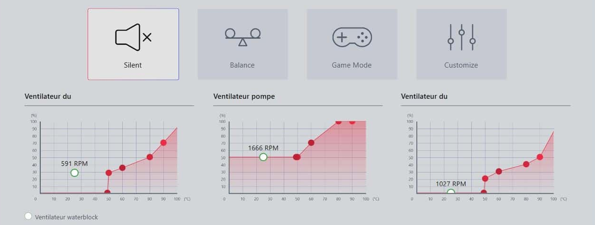
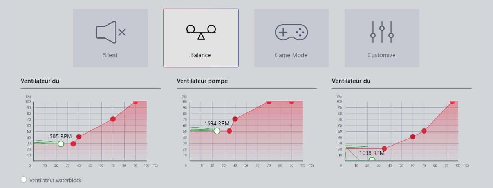
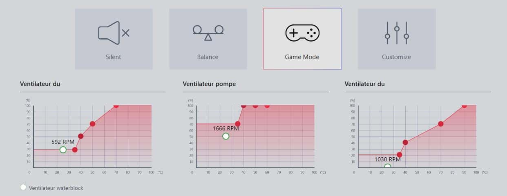

# coreliquid_driver

This is a fork of the original [project](https://github.com/sarzeaud/coreliquid_driver) that doesn't work on my MEG S360. Probably because the interaction protocol has changed since its creation.

A simple linux driver for MSI MEG Coreliquid S360 AIO watercooling

Having unsuccessfully tried to use [liquidctl](https://github.com/liquidctl/liquidctl)
to drive my MSI MEG coreliquid AIO watercooling under linux (specifically Debian 12),
I decided to build mine. I don't care about the display on this AIO, I just want it
to react to CPU temperature. I only allow 5 predefined modes to make the link between
temperature and fan and pump speed:
    SILENT = 0,
    BALANCE = 1,
    GAME = 2,
    DEFAULT = 4,
    SMART = 5.
In this first version, the CUSTOMIZE = 3 mode is not allowed, as the 5 others
should do the job. Here are pictures from the MSI soft for Windows, showing the link
between temperature and fan speeds for three modes.







## Dependencies

You need `libsensors-dev` and `libhidapi-dev` (or `hidapi` on Arch) to compile.
The CMake build will automatically fetch `hidapi` via FetchContent if it's not found,
but having the system library is recommended for stability.

## Compilation

```bash
mkdir build
cd build
cmake -DCMAKE_BUILD_TYPE=Release ..
cmake --build . --config Release
```

Here, I use libhidapi-hidraw, but I guess it would work as well with libhidapi-libusb0.
I choose the former (hidraw) because it seems to be the recommended one these days.

## Installation

After building, you can install the driver system‑wide:

```bash
sudo cmake --install . --prefix "/usr/local"
```

This will install:

- The executable `/usr/local/bin/my_msi_coreliquid_driver`
- The systemd service `/usr/lib/systemd/system/my_msi_coreliquid_driver.service`
- The sleep‑resume script `/usr/lib/systemd/system-sleep/my_msi_coreliquid_driver_sleep.sh`

### udev rules

To allow non‑root access to the device, copy the provided udev rules:

```bash
sudo cp 99-msi-coreliquid.rules /etc/udev/rules.d/
sudo udevadm control --reload-rules && sudo udevadm trigger
```

## Usage

**my_msi_coreliquid_driver -M mode [ startd ]**

**-M** sets the cooling mode to *mode* (0‑5, except 3). The modes are:

- `0` – SILENT
- `1` – BALANCE
- `2` – GAME
- `4` – DEFAULT (constant speed)
- `5` – SMART (temperature‑based, default)

**startd** starts the driver as a daemon (not needed if using systemd service).

Example:

```bash
# Set mode to GAME
sudo my_msi_coreliquid_driver -M 2

# Start as a one‑shot daemon (for testing)
sudo my_msi_coreliquid_driver -M 5 startd
```

## Daemon (systemd)

If you installed via `cmake --install`, the systemd service is already placed.
Enable and start it with:

```bash
sudo systemctl daemon-reload
sudo systemctl enable my_msi_coreliquid_driver.service
sudo systemctl start my_msi_coreliquid_driver.service
```

The service runs with mode `5` (SMART) by default. To change the mode, edit the service file
(`/usr/lib/systemd/system/my_msi_coreliquid_driver.service`) and modify the `-M` argument.

## Arch Linux

You can build from source using the provided PKGBUILD.

```bash
makepkg -i
```


## License

GPLv3 – see the LICENSE file.
