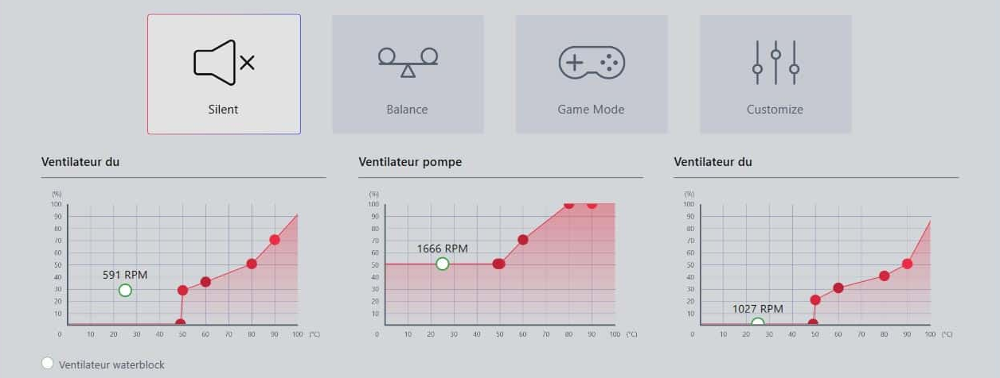
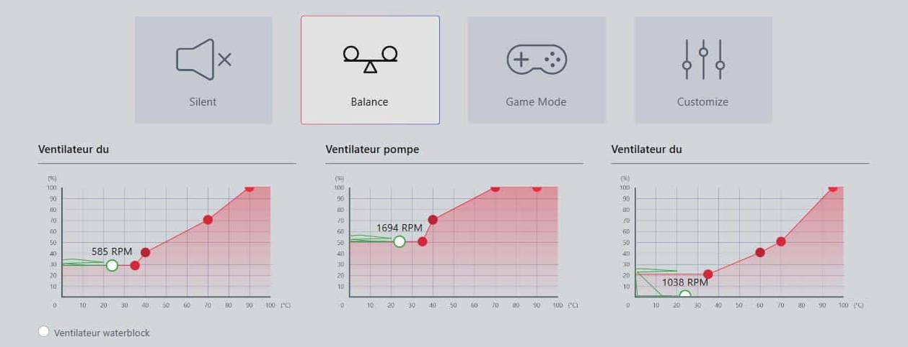
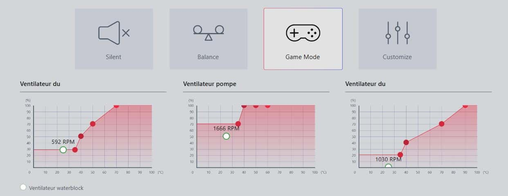

# coreliquid_driver

This is a fork of the original [project](https://github.com/sarzeaud/coreliquid_driver) that doesn't work on my MEG S360. Probably because the interaction protocol has changed since its creation.

A simple linux driver for MSI MEG Coreliquid S360 AIO watercooling

Having unsuccessfully tried to use [liquidctl](https://github.com/liquidctl/liquidctl)
to drive my MSI MEG coreliquid AIO watercooling under linux (specifically Debian 12),
I decided to build mine. I don't care about the display on this AIO, I just want it
to react to CPU temperature. I only allow 5 predefined modes to make the link between
temperature and fan and pump speed:
    SILENT = 0,
    BALANCE = 1,
    GAME = 2,
    DEFAULT = 4,
    SMART = 5.
In this first version, the CUSTOMIZE = 3 mode is not allowed, as the 5 others
should do the job. Here are pictures from the MSI soft for Windows, showing the link
between temperature and fan speeds for three modes.







## Compilation

You need to install libsensors-dev and libhidapi-dev to compile. Then, it is as simple as:

```bash
gcc my_msi_driver.c -lhidapi-hidraw -lsensors -o /where/you/want/my_msi_driver
```

Here, I use libhidapi-hidraw, but I guess it would work as well with libhidapi-libusb0.
I choose the primer because it seems to be the recommanded one these days.

## Usage

my_msi_driver **-M** *mode* [ **startd** ]

**-M** sets the cooling mode to *mode*.

**startd** starts the driver daemon. This should rather be done through systemctl (see below).

## Daemon

If you want this program to run as a daemon on your system, just:

```bash
sudo cp my_msi_driver.service /etc/systemd/system/
```

In this file, adapt the ExecStart path for where you put the executable, and choose
you cooling mode. Then run:

```bash
sudo systemctl daemon-reload
sudo systemctl enable my_msi_driver.service
```

The driver will start as a daemon on next boot. If you want it to run at once:

```bash
sudo systemctl start my_msi_driver
```
